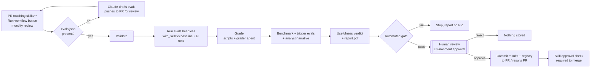

# Skill evaluation automation

Automated evaluation and benchmarking for Claude skills, built on the eval tooling that ships with
Anthropic's **skill-creator** (Skills 2.0): the same `evals.json` format, grader agent, benchmark
aggregation (`benchmark.json`, mean ± stddev, with/without-skill delta), trigger evals and review viewer -
run headless in CI, with a human approval gate before anything is stored in git.

Every run produces a **PDF evaluation report** and a **usefulness verdict** - is the skill still worth
having, or are newer models making it obsolete? - by running each test case with and without the skill
on several models and tracking that uplift across model releases.



## What a run does

| Stage | What happens | Built on |
|---|---|---|
| Validate | Frontmatter, single SKILL.md, name/description limits, eval-set schema, input files exist | `scripts/quick_validate.py` |
| Execute | Each eval prompt runs in an isolated folder via `claude -p` on **every configured model**, once **with** the skill installed in `.claude/skills/` and once against a **baseline** (no skill for new skills, the previous version from the base branch for changed skills), N times each, in parallel | skill-creator run layout |
| Grade | Script expectations run deterministically; text expectations go to the skill-creator grader agent, which also critiques weak assertions | `agents/grader.md` |
| Benchmark | Pass rate, time and tokens per configuration with mean ± stddev and delta; whether the skill was actually loaded in each run | `scripts/aggregate_benchmark.py` |
| Trigger evals | Should-trigger / near-miss queries check that the description makes Claude load the skill | `scripts/run_eval.py` |
| Analyst | Claude reads the results and transcripts and writes the narrative: headline, where the skill helped, where it did not (with fixes), what differed per case, and a value category for each check. It never supplies numbers - those come from code | `agents/analyzer.md` |
| A/B benchmark | Skills 2.0 blind comparison: the comparator agent sees the with-skill and baseline outputs as A/B in random order and picks the better one -> win rate per model (>= 70% keep, 50-70% refine, < 50% remove or rewrite) | `agents/comparator.md` |
| Description review | Trigger optimization: is the description too broad, too narrow or overlapping another skill in the repo? Suggests a rewrite that says when to use the skill and when not to | `run_eval.py` results + analyzer |
| Token usage | Input / output / cache tokens and cost per model and configuration, and per stage (skill runs, grading, comparison, analysis) | `usage.json` |
| Verdict | Per model: uplift, checks only the skill gets right, checks the model now passes unaided, token overhead, trend vs past approved evaluations -> KEEP / KEEP, SLIM DOWN / RETIRE CANDIDATE / HARMFUL | see below |
| Gate | Thresholds from `skilleval.config.yaml` (pass rate, delta vs baseline, regression vs last approved, trigger accuracy, harness errors) | |
| Report | `report.pdf` (the evaluation report), `SUMMARY.md` (PR comment + job summary) and `review.html` - the skill-creator viewer with every prompt, output file and grade | `eval-viewer/generate_review.py` |
| Human gate | The `human-review` job waits on the `skill-eval-approval` environment; a named reviewer approves or rejects | GitHub Environments |
| Store | Approved results and the report go to `eval-results/<skill>/<timestamp>-<version>/`; `latest.json`, `history.json` (per-model uplift over time) and `registry/skills-registry.json` are updated, committed with the approver's name | |

## The report

`report.pdf` follows the structure of a hand-written skill eval report, generated for every run. The same
content (minus the long tables) is the GitHub job summary and PR comment.

0. **Skill under test** - name, the full **description** (what Claude reads to decide whether to load it),
   length vs the 1,024-character limit, whether it says when to use / not use the skill, SKILL.md size and
   bundled files; and a **"Evaluated with Skills 2.0"** banner
1. **Verdict** - KEEP / KEEP, SLIM DOWN / RETIRE CANDIDATE / HARMFUL, the reason, and a per-model table
2. **Outlook as models evolve** - is uplift shrinking on more capable models, or versus past evaluations?
3. **Headline** - checks passed, pass rate, cases fully passed, tokens and time per model and configuration, with uplift rows
4. **Where the skill made the difference / where it does not help** (with concrete fixes)
5. **What still needs the skill, and what models now do unaided** - every check classified per model
6. **Trend across approved evaluations** (once there is history)
7. **A/B benchmark (blind comparison)** - win rate per model with the Skills 2.0 reading
8. **Skills 2.0 evaluation steps, as run** - every step from the Skills 2.0 guide (validate, define test
   cases, run in parallel with clean contexts, grade, metrics, fix failures, re-run to the threshold, A/B
   benchmark, interpret, trigger tests, description revision, review, version in git, re-benchmark) with the
   skill-creator component behind it and its result
9. **Side by side per case**, **tokens and time per case**, **token usage** (input/output/cache/cost by
   model, configuration and stage), **what differed in each case**
10. **Check-by-check results** on every model and **specific failures** with the grader's evidence
11. **Trigger optimization** - every trigger query with its result, the description review and a suggested
    rewrite
12. **Test cases used** - every prompt in full, expected output, checks, input files and where the case
    came from (the skill's evals.json or your own file), then **when to re-benchmark** and **limits**

Every number is computed from the graded runs; Claude writes only the prose, so the tables can be trusted
even when the narrative is wrong.

## Is the skill still useful? (the verdict)

For each model the pipeline compares with-skill and without-skill runs check by check:

- **Only with skill** - the model passes the check only when the skill is loaded: the value the skill adds.
- **Unaided** - the model passes it without the skill: guidance that can be trimmed.
- **Worse with skill** - the skill gets in the way.

| Verdict | Rule (defaults in `skilleval.config.yaml` -> `verdict`) | What to do |
|---|---|---|
| KEEP | uplift >= 15 pts, or the skill alone gets a `safety` check right | Keep |
| KEEP, SLIM DOWN | uplift 5-15 pts, or several unique checks | Remove guidance for the unaided checks to cut tokens |
| RETIRE CANDIDATE | uplift < 5 pts and at most 1 unique check | Retire, or keep only bundled assets / org-specific facts |
| HARMFUL | uplift < 0 | Fix the cases under "where it does not help" or retire |

The overall verdict is the best one across `production_models` (a skill stays while any model your users
run still needs it). The outlook flags when uplift falls on more capable models in the same run, and when
it drops by 10+ pts for a model compared with the last approved evaluation.

**Why categories matter:** value from `asset` (bundled logos, templates) and `org_knowledge` (rules only
your organisation knows) will not be absorbed by model upgrades; value from `quality` and `behavior` usually
is. Tag checks with a `category` in `evals.json`; the analyst categorises any you leave out.

**Monthly usefulness review:** on the 1st of every month the workflow re-runs every skill against no skill
on the models in `skilleval.config.yaml`, opens a GitHub issue for any skill whose verdict changed or became
RETIRE CANDIDATE / HARMFUL, and sends the results to human review as usual. When a new model ships, add it
to `execution.models` (least to most capable) or pass it in the Run workflow form.

### evals.json fields used by the report

```json
{
  "id": 5, "name": "prohibited-letterhead", "type": "edge",
  "description": "Prohibited letterhead requests",
  "prompt": "...", "files": ["evals/files/logo-request.docx"],
  "expectations": [
    {"text": "Declines recolouring the logo", "category": "safety"},
    {"text": "Uses the approved logo asset", "category": "asset", "script": "evals/checks/logo.py"},
    "Points the user to Corporate Communications"
  ]
}
```

`type` is one of standard, edge, ambiguous, review, complex, should_not_trigger. A `should_not_trigger`
case automatically gets a "Skill not invoked" check read from the run's tool calls.

## Your own test cases

Evaluate any skill with **your** prompts - instead of, or on top of, its `evals/evals.json`:

- **GitHub:** Actions → *Skill evaluation* → *Run workflow* → `test_cases`: a repo path such as
  `test-cases/my-cases.csv`, **or paste JSON / CSV into the box**; `test_cases_mode`: `replace` (only yours)
  or `append` (the skill's cases + yours).
- **Locally:** `python -m skilleval run --skill NAME --test-cases my-cases.csv [--test-cases-mode append]`
- **Keep them:** `python -m skilleval import-cases --skill NAME --file my-cases.csv` writes them into the
  skill's `evals/evals.json`.

CSV columns: `prompt`, `expectations` (separated by ` | `, optional `[safety]`/`[org_knowledge]`/... prefix),
and optionally `skill`, `id`, `name`, `type`, `description`, `expected_output`, `files`. JSON uses the
skill-creator schema. Templates and details: [test-cases/](test-cases/README.md).

## Skills in this repo

| Skill | What it does | Why it is here |
|---|---|---|
| `csv-data-profiler` | Data-quality report for a CSV/TSV | Mostly generic guidance - shows how much newer models absorb |
| `incident-postmortem` | Blameless postmortem in a house format with an org SEV scale | Bundled template + org rules: value models cannot learn |
| `snowflake-sql-review` | Reviews SQL against org rules (critical skill, 90% target) | Safety checks (blocks destructive prod SQL) |
| `conventional-commits` | Conventional Commits messages | Almost entirely generic: a likely retire candidate on strong models |

## Repo layout

```
skills/<skill-name>/SKILL.md            the skill (one folder per skill)
skills/<skill-name>/evals/evals.json    functional evals (skill-creator schema)
skills/<skill-name>/evals/trigger_evals.json   optional trigger evals
skills/<skill-name>/evals/files/        input files for evals
skills/<skill-name>/evals/checks/*.py   optional deterministic checks
skills/<skill-name>/evals/eval-config.yaml     optional per-skill config overrides
eval-results/<skill>/...                approved results (written only after human approval)
eval-results/<skill>/history.json       per-model uplift and verdict for every approved evaluation
registry/skills-registry.json           current approved version, pass rate, verdict, approver, history
skilleval/                              the pipeline (CLI: python -m skilleval)
skilleval/vendor/skill_creator/         vendored skill-creator tooling (Apache 2.0)
test-cases/                             your own test-case files + templates (CSV / JSON)
skilleval.config.yaml                   models, runs, parallelism, gate thresholds, A/B comparison, targets
```

## One-time setup (GitHub)

1. Push this folder to a repo (or copy `skilleval/`, the config and `.github/` into an existing skills repo).
2. **Secrets** (Settings → Secrets and variables → Actions): `ANTHROPIC_API_KEY`.
   For Amazon Bedrock instead: variable `CLAUDE_CODE_USE_BEDROCK=1`, variable `AWS_REGION`, secrets
   `AWS_ACCESS_KEY_ID` / `AWS_SECRET_ACCESS_KEY`, and set Bedrock model IDs in `skilleval.config.yaml`.
3. **Human gate**: Settings → Environments → New environment `skill-eval-approval` → tick
   *Required reviewers* and add the people (or team) who may approve skills. Optionally tick
   *Prevent self-review*. (Required reviewers on private repos need GitHub Team or Enterprise.)
4. **Merge protection**: in a branch ruleset for the default branch, require the status check
   `Skill approval check / verify`. It fails unless every changed skill has an approved result for its
   exact current content, so editing a skill after approval re-blocks the merge.
5. **Bot token (recommended)**: add a fine-grained PAT or GitHub App token with `contents: write` and
   `pull-requests: write` as `SKILL_EVAL_BOT_TOKEN`. Commits pushed with the default `GITHUB_TOKEN` don't
   trigger other workflows, so without it the approval check won't re-run on the results commit
   (re-run it manually in that case).
6. Settings → Actions → General → allow GitHub Actions to create pull requests (needed for manual runs).

## Day-to-day use

**New or changed skill** - open a PR that adds/edits `skills/<name>/`.
- No evals yet? Claude drafts `evals.json` and `trigger_evals.json`, pushes them to the PR and stops. Edit them
  (they define what "good" means), push, and the evaluation starts.
- The PR gets a results comment. Download the run artifact, open `review.html`, then go to the run and
  **Review deployments → Approve** (add a comment - it's stored as the approval note) or **Reject**.
- On approval the results commit lands in the same PR, so the skill and its evidence merge together.

**Re-evaluate any skill (a few clicks)** - Actions → *Skill evaluation* → *Run workflow*: enter skill names
or `all`, optionally a model list, runs and baseline (`without_skill` for a usefulness verdict). Useful after
a model upgrade. Approved results arrive as a PR.

**Dry run of the whole flow at zero cost** - choose executor `mock`.

## Local use

```bash
pip install -r requirements.txt -r requirements-skills.txt   # needs the `claude` CLI, authenticated
python -m skilleval list
python -m skilleval validate --all
python -m skilleval draft-evals --skill my-skill
python -m skilleval run --skill my-skill --runs 1 --models claude-haiku-5-5,claude-sonnet-5-5 --no-trigger
open skilleval-workspace/my-skill/report.pdf         # the evaluation report + verdict
open skilleval-workspace/my-skill/review.html        # every output and grade
python -m skilleval publish --approver "$USER" --commit      # local equivalent of the human gate
python -m skilleval verify --changed origin/main
```

## Writing evals that mean something

- Assertions should be things a run **without** the skill would plausibly fail. The analyst notes call
  out assertions that pass in both configurations - rewrite those, they inflate scores without proving value.
- Prefer a check script for anything exact (counts, file present, schema valid) and keep the grader for
  judgement calls.
- Add near-miss queries to `trigger_evals.json`; a skill that never loads scores like the baseline.
- `runs_per_config: 3` is the minimum for a meaningful ± stddev; use 1 only while iterating.

## Cost control

Every eval × configuration × model × run is one `claude -p` session plus one grading call; each
(eval × model × run) pair adds one blind comparison call, and each skill gets one analyst call. The
report's **Token usage** section shows the exact split. Turn the comparison off with `comparison.enabled:
false` or `--no-compare`. Ten evals, two configurations, two models and three runs is 120 sessions +
120 gradings; use `--runs 1` while iterating. Test run: 3 evals × 2 configs × 2 models × 1 run on Haiku and
Sonnet cost about $0.48 in skill runs; grading and the analyst pass (Opus) come on top. `max_budget_usd_per_run` caps each session;
`run.json` records actual cost; `executor: mock` costs nothing.
